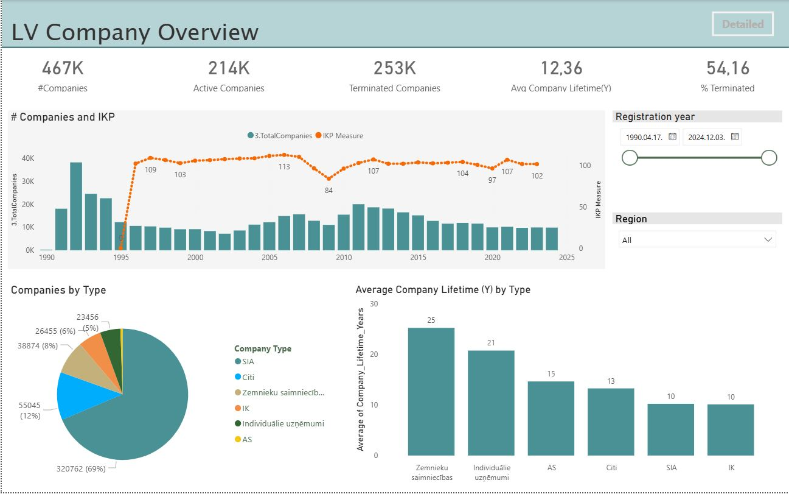
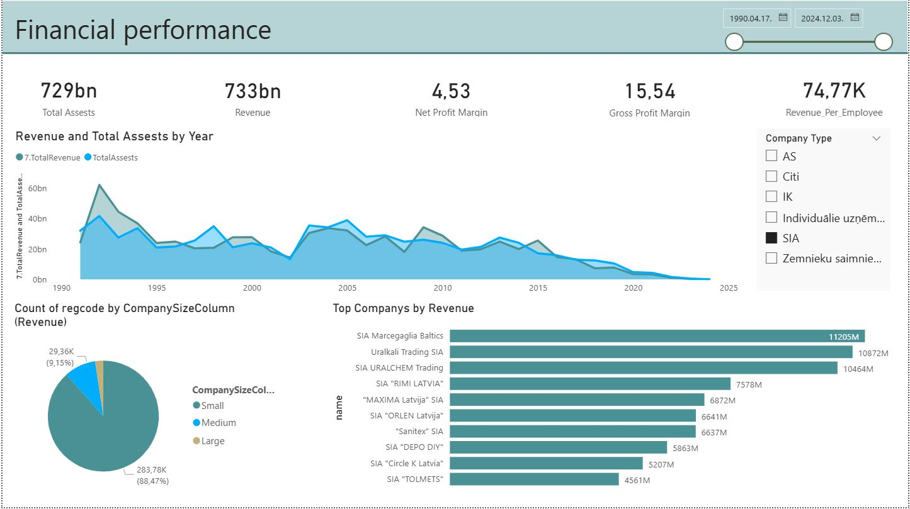

# 💸 Power BI Cash Flow Dashboard with Hierarchical Logic

This project presents a professional **Cash Flow Dashboard** built in **Power BI**, featuring a **three-level hierarchy**, dynamic DAX logic, and clean matrix visuals. The report is designed to make financial reporting more structured, clear, and insightful — ideal for multi-country or group-level analysis.

🔗 **View the published report here**: [Power BI Report Link](https://app.powerbi.com/view?r=eyJrIjoiMDYyNGM1ZTctNTRkMS00ZGE2LTk3ZmMtZTg0NjhiZjA4NDczIiwidCI6IjhhOTVlM2Y0LTAzZTgtNGM2Yi1iZDIzLTdjZGM5YzlhNDA1ZiIsImMiOjl9)

---

## 🧩 Features

- ✅ **Hierarchical drill-down** structure with:
  - Level 1: Cash Flow Groups  
  - Level 2: Sub-groups  
  - Level 3: Individual items
- ✅ **Dynamic DAX calculations** to:
  - Show amounts only at the appropriate level
  - Hide group headers from showing incorrect totals
- ✅ **Monthly amount breakdown** for detailed analysis
- ✅ Compatible with multiple countries and organizational structures
- ✅ Clean and customizable matrix visuals

---

## 📊 Screenshot Highlights

### 📌 Hierarchical Matrix View  


---

### 📆 Monthly Breakdown by Position  


---

### 🧠 Totals and Header Logic  


---

## 🧠 Sample DAX Logic

```dax
CF_Amount_Display := 
VAR CurrentLevel3 = SELECTEDVALUE(DIM_CFS_Positions[ID_Level3])
VAR IsLevel3 = ISINSCOPE(DIM_CFS_Positions[ID_Level3])
RETURN
SWITCH(
    TRUE(),
    IsLevel3,
        CALCULATE(SUM(FACT_CashFlow[Amount])),
    BLANK()
)
